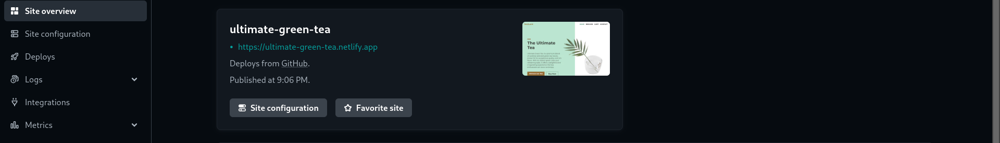

# Ultimate Tea ☕️🍵

A great ultimate tea simple website. Start Your Day With hot Green Tea ☕️.

https://ultimate-green-tea.netlify.app/

## Cloning the project 🪛

```
# Clone this repository
$ git clone https://github.com/MastooraTurkmen/Ultimate-tea.git

# Go inside the repository
$ cd Ultimate-tea
```

---

## Screenshots 📸

### Mobile 📱


### Tablet 📱💻


### DeskTop 💻


---

## Languages and Tools are used 🛠 🗣️

1. **Languages** 🗣️

   - [HTML](https://github.com/topics/html)
   - [HTML5](https://github.com/topics/html5)
   - [CSS](https://github.com/topics/css)
   - [CSS3](https://github.com/topics/css3)
   - [JavaScript](https://github.com/topics/javascript)

2. **Tools** 🔧
   - [Chrome](https://github.com/topics/chrome)
   - [Figma](https://github.com/topics/figma)
   - [VSCode](https://github.com/topics/vscode)
   - [Netlify](https://github.com/topics/netlify)

---

## Deployment 📥

1. How to deploy our project to the Netlify site?
2. I use [Netlify App](https://app.netlify.com/) for deploying my projects.
3. From there select **_Deploy with Github_**.
   
4. Then write your project name and select it.
5. After selecting here you can see that the project **_Review configuration for Ultimate-tea_** and then select the **_Deploy Ultimate-tea_** Button.
6. Now your project is Live.
   

---

## Author 👩🏻‍💻

**Mastoora Turkmen**  
[LinkedIn](https://www.linkedin.com/in/mastoora-turkmen/)
<br>
[Github](https://github.com/MastooraTurkmen/)
<br>
[Twitter](https://twitter.com/MastooraJ22)
<br>
