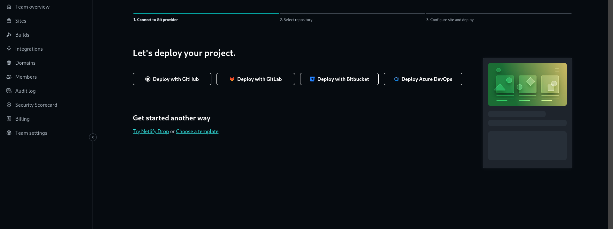

# Ultimate Tea ☕️🍵

https://ultimate-green-tea.netlify.app/

## Cloning the project 🪛

```
# Clone this repository
$ git clone https://github.com/MastooraTurkmen/Ultimate-tea.git

# Go inside the repository
$ cd Ultimate-tea
```


------


## Screenshots 📸

### Mobile 📱


### Tablet 📱💻


# DeskTop 💻


------


## Languages and Tools are used 🛠 🗣️

1. **Languages** 🗣️
    + [HTML](https://github.com/topics/html)
    + [HTML5](https://github.com/topics/html5)
    + [CSS](https://github.com/topics/css)
    + [CSS3](https://github.com/topics/css3)
    + [JavaScript](https://github.com/topics/javascript)

2. **Tools** 🔧
    + [Chrome](https://github.com/topics/chrome)
    + [Figma](https://github.com/topics/figma)
    + [VSCode](https://github.com/topics/vscode)
    + [Netlify](https://github.com/topics/netlify)


------

## Deployment 📥

1. How to deploy our project to the Netlify site?
2. I use [Netlify App](https://app.netlify.com/) for deploying my projects.
4. From there select **_Deploy with Github_**.
   
5. Then write your project name and select it.
6. After selecting here you can see that the project **_Review configuration for Ultimate-tea_** and then select the **_Deploy Ultimate-tea_** Button.
7. Now your project is Live.
